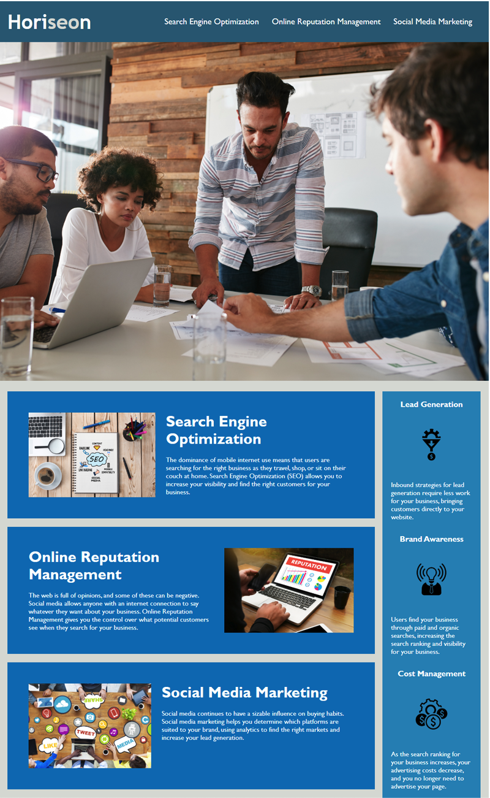

# Code Refactor
##  Description
This assignment was received as part of the UCONN Coding Boot Camp.
The goal was to refactor the intial code received that followed accessiblity standards, allowing the site to be optimized for search engines.  
## Developer
Horiseon Online Service's website experienced a number of HTML semantic challenges in the initial code, which can be found in the initial commit.
These challenges went against accessibility standards.  I focused on making sure the application's links functioned correctly, consolidating 
the CSS selectors to follow semantic structure, and commenting the CSS and HTML files appropriately.  
**View the refactored web page:** [Horiseon - Refactored][demo]

## Mock Up 
The following image shows the web application's appearance and functionality:

[demo]: https://rpc08002.github.io/1-code-refactor/.